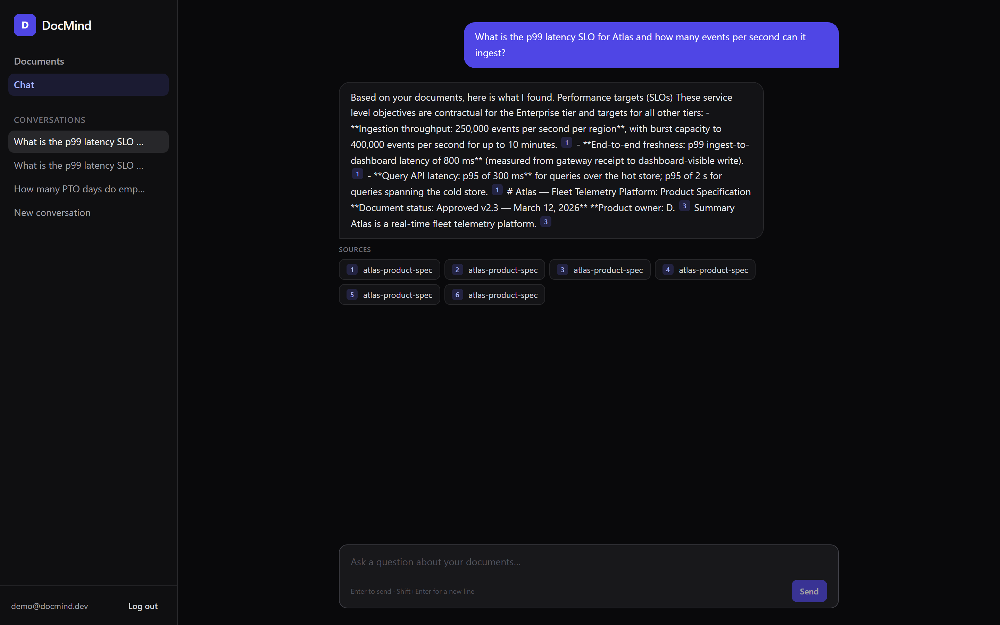
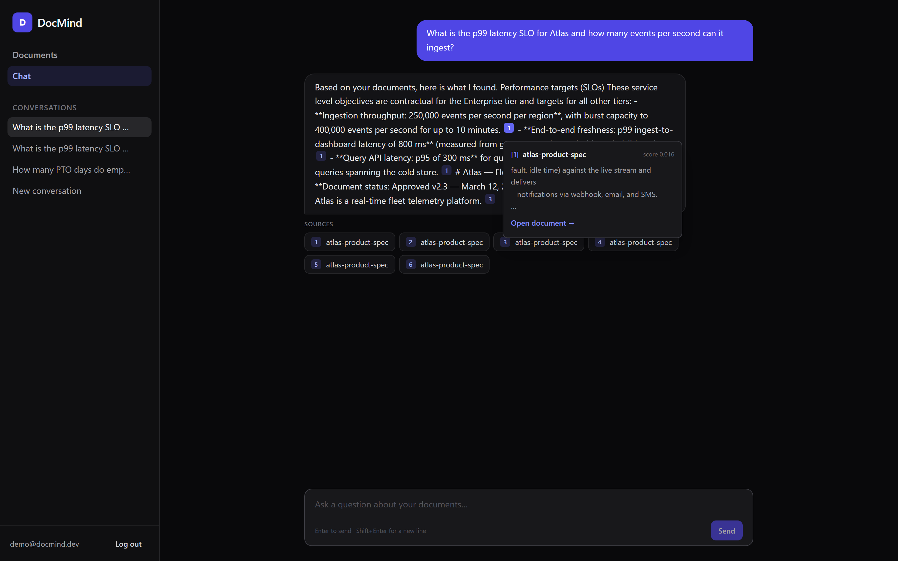
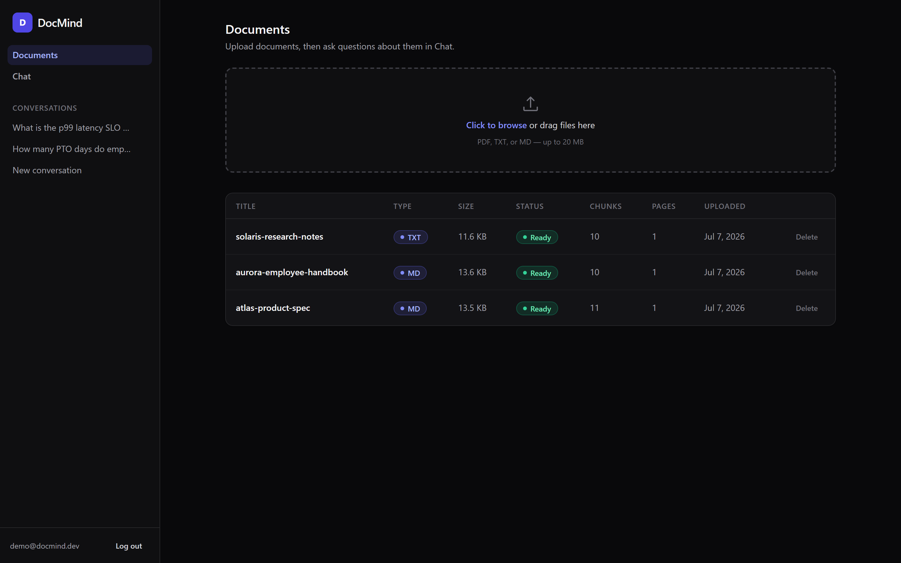
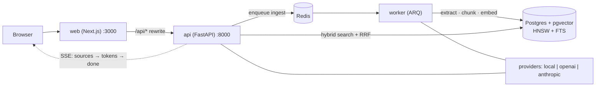

# DocMind

Chat with your documents — hybrid RAG (pgvector + Postgres FTS with reciprocal rank fusion), streaming citation-grounded answers, and an eval suite that gates CI on retrieval quality.

[](https://github.com/AhmadReyan/docmind/actions/workflows/ci.yml)
[](LICENSE)
[](backend/pyproject.toml)
[](frontend)

## Why this project is interesting

- **Hybrid retrieval, properly fused.** Every query runs both a pgvector HNSW cosine search and a Postgres full-text search, merged with Reciprocal Rank Fusion (k=60) — so exact tokens (`"$499"`, `"NX-3"`) and pure paraphrases both retrieve. No second search system to keep in sync.
- **Runs end-to-end with zero API keys.** Local fastembed embeddings and a deterministic extractive answerer mean `docker compose up` gives a full working demo — and one env var swaps in OpenAI, Anthropic, or any OpenAI-compatible server.
- **Retrieval quality is CI-gated.** A 15-case golden set (easy lookups, paraphrase-only questions, cross-section questions) runs on every push against a real pgvector database; the build fails if hit-rate@5 drops below threshold.
- **Streaming citations UX.** Answers stream over SSE with sources emitted *before* the first token, so the UI renders citation targets immediately and `[n]` markers in the text link to real chunks.
- **Scanned PDFs just work.** Pages with no text layer automatically fall back to OCR (RapidOCR — bundled ONNX models, CPU-only, fully offline), so image-only documents like scanned reports and receipts are searchable too.



<details>
<summary>More screenshots</summary>

**Citation popovers** — every `[n]` marker opens the exact source chunk it came from:



**Document library** — upload, background ingestion with live status, chunk browser:



</details>

## Quickstart

Requirements: Docker with Compose.

```bash
cp .env.example .env    # works as-is — no edits needed (Windows: copy .env.example .env)
docker compose up --build
```

Open **http://localhost:3000** and log in with the demo account:

```
email:    demo@docmind.dev
password: demo1234
```

Three seed documents (an employee handbook, a product spec, and research notes) are pre-loaded and ingested by the worker in the background on first boot — give it a few seconds, then ask things like *"how many PTO days do I get?"* or *"what does the Growth tier cost?"*.

> ### Runs 100% free — no API keys
>
> The defaults in `.env.example` use **local fastembed embeddings** (a 384-dim ONNX model that downloads once and runs on CPU) and a **deterministic extractive answerer** that builds cited answers directly from retrieved chunks. Nothing leaves your machine. To use hosted models, set:
>
> | Setting | `local` (default) | `openai` | `anthropic` |
> |---|---|---|---|
> | `EMBEDDING_PROVIDER` | fastembed, no key | `OPENAI_API_KEY` + `OPENAI_EMBEDDING_MODEL` | — (Anthropic has no embeddings API) |
> | `LLM_PROVIDER` | extractive answerer, no key | `OPENAI_API_KEY` + `OPENAI_LLM_MODEL` | `ANTHROPIC_API_KEY` + `ANTHROPIC_MODEL` |
>
> The two settings are independent — local embeddings with Claude generation is a perfectly good pairing. `OPENAI_BASE_URL` points the OpenAI provider at any compatible server (**Ollama, LM Studio, vLLM**), which keeps everything local *and* gives you a real LLM.

## Architecture

Five services: a Next.js frontend, a FastAPI API, an ARQ ingestion worker (same image as the API), Postgres with pgvector as the only datastore, and Redis for the job queue and rate limiting.



Uploads return `202` and are ingested asynchronously (extract → chunk → embed → index). Chat retrieves top-20 from each index, fuses with RRF, and streams the answer with frozen source snapshots persisted per message. Auth is a JWT in an httpOnly cookie; chat and uploads are rate-limited via a Redis sliding window.

Full detail with sequence diagrams: **[docs/architecture.md](docs/architecture.md)**

## RAG evaluation

Retrieval quality is a tested property, not a vibe. `backend/evals/golden_set.json` holds 15 questions over the seed corpus — easy lookups, paraphrased questions with no lexical overlap (these fail on FTS-only retrieval), and cross-section questions. On every push, CI spins up a disposable pgvector container, ingests the corpus with the real pipeline, and runs each question through the real `retrieve()`:

```bash
cd backend
python -m evals.run_eval --min-hit-rate 0.8 --summary "$GITHUB_STEP_SUMMARY"
```

A case is a **hit** if a top-5 chunk comes from the expected document and contains an answer keyword; the build fails below the hit-rate threshold. Sample output:

| Metric | Value |
|---|---|
| hit_rate@5 | 0.93 |
| MRR | 0.87 |
| cases | 15 |

How the metrics work and how to add cases: **[backend/evals/README.md](backend/evals/README.md)**

## API overview

Full contract (shapes, error codes, SSE protocol): **[docs/api-contract.md](docs/api-contract.md)**

| Area | Endpoints |
|---|---|
| Auth | `POST /api/auth/register` · `POST /api/auth/login` · `POST /api/auth/logout` · `GET /api/auth/me` |
| Documents | `POST /api/documents` (multipart, 202 + async ingest) · `GET /api/documents` · `GET /api/documents/{id}` · `GET /api/documents/{id}/chunks` · `DELETE /api/documents/{id}` |
| Chat | `POST /api/conversations` · `GET /api/conversations` · `GET /api/conversations/{id}` · `DELETE /api/conversations/{id}` · `POST /api/conversations/{id}/messages` (SSE stream) |
| Health | `GET /api/health` |

## Project structure

```
├── backend/
│   ├── app/            # FastAPI app: auth, documents, chat, RAG, providers, ingestion
│   ├── alembic/        # schema migrations (incl. HNSW + GIN indexes)
│   ├── evals/          # golden set + retrieval eval harness (CI gate)
│   ├── seed_data/      # demo corpus (3 original fictional documents)
│   └── tests/          # unit + testcontainers integration tests
├── frontend/
│   └── src/            # Next.js app (chat UI, documents, auth)
├── docs/               # api-contract.md · architecture.md · decisions.md
├── docker-compose.yml  # web · api · worker · postgres(pgvector) · redis
└── .env.example        # zero-key defaults
```

## Development

**Backend** (Python 3.12, [uv](https://docs.astral.sh/uv/)):

```bash
cd backend
uv sync                     # install deps
uv run ruff check .         # lint
uv run mypy app             # typecheck
uv run pytest               # tests — integration tests need Docker (testcontainers)
```

**Frontend** (Node 20+):

```bash
cd frontend
npm install
npm run lint
npm run typecheck
npm test
```

Run the eval suite locally with `python -m evals.run_eval` from `backend/` (needs Docker unless `EVAL_DATABASE_URL` is set).

## Design decisions

Eight short ADRs in **[docs/decisions.md](docs/decisions.md)**:

| # | Decision |
|---|---|
| 1 | ARQ over Celery for async-native background jobs |
| 2 | Fixed 384-dim embeddings across all providers (no schema migration on switch) |
| 3 | LLM and embedding providers selected independently |
| 4 | Local extractive answerer for a zero-key demo |
| 5 | Hybrid retrieval with RRF over vector-only |
| 6 | SSE over WebSockets for chat streaming |
| 7 | JWT in httpOnly cookie, no refresh tokens (deliberate scope cut) |
| 8 | Local disk storage behind a Storage protocol |

## License

[MIT](LICENSE)
