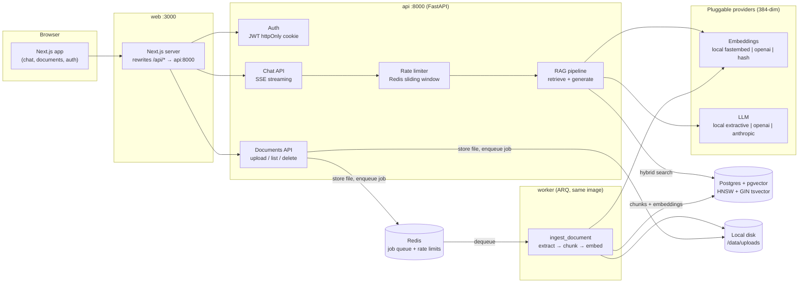
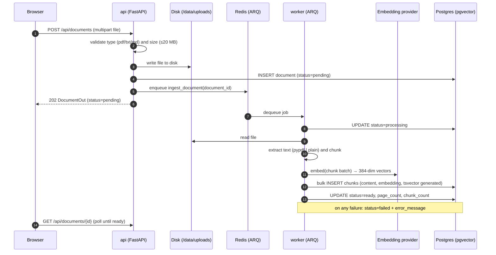
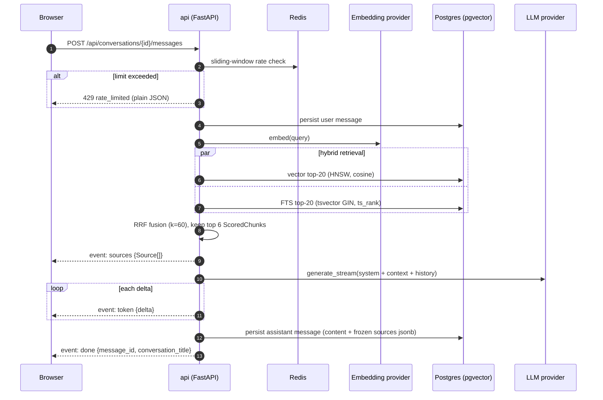

# DocMind Architecture

DocMind is a document-intelligence app: users upload documents, an async
worker ingests them into a hybrid (vector + full-text) index, and a chat
interface answers questions with streamed, citation-grounded responses.

Five services run under docker-compose (names and ports are pinned in
[docs/api-contract.md](api-contract.md)): the Next.js `web` frontend, the
FastAPI `api`, the ARQ `worker` (same image as `api`), `postgres`
(pgvector/pgvector:pg16), and `redis`.

## System components

### Component notes

- **web** — Next.js serves the UI and proxies `/api/*` to the API container,
  so the browser talks to a single origin and the auth cookie stays
  first-party. No API URL configuration leaks into client code.
- **api** — FastAPI app. Owns auth (JWT in an httpOnly cookie), document
  CRUD, conversations, and the SSE chat endpoint. It never does heavy work
  inline: uploads are written to disk and a job is enqueued.
- **worker** — an ARQ worker running from the *same image* as the API (one
  Dockerfile, two commands), so ingestion code shares the models, config, and
  providers without a second build. It processes `ingest_document` jobs:
  extract text (pypdf / plain text / markdown), chunk, embed, and bulk-insert
  chunks.
- **postgres (pgvector)** — the only datastore. Chunks carry both a 384-dim
  vector (HNSW index, cosine) and a generated `tsvector` column (GIN index),
  which is what makes hybrid retrieval a two-query, one-database problem
  instead of a two-system synchronization problem.
- **redis** — ARQ job queue plus the sliding-window rate limiter for chat and
  uploads.
- **providers** — embedding and LLM providers are selected independently via
  env (`EMBEDDING_PROVIDER`, `LLM_PROVIDER`). All embedding providers emit
  384-dim vectors so switching providers never requires a schema migration.
  The `local` pair (fastembed + extractive answerer) makes the whole stack
  run with zero API keys.

## Ingestion pipeline

Upload returns `202` immediately; everything below the enqueue is
asynchronous, and the document row's `status` field (`pending → processing →
ready | failed`) is the frontend's polling contract.

## RAG query flow

Chat responses stream over SSE with a fixed event order — `sources` first
(so the UI can render citation targets before any text arrives), then
`token` deltas, then `done`.

### Retrieval design

Both retrieval legs run against the same `chunks` table, scoped to the
requesting user (`user_id` is denormalized onto chunks so the filter is one
predicate, not a join):

1. **Vector leg** — cosine similarity over the HNSW index against the query
   embedding; catches paraphrases with no lexical overlap.
2. **Lexical leg** — Postgres full-text search over the generated `tsvector`
   column ranked with `ts_rank`; catches exact identifiers, numbers, and
   names that embeddings blur.

Results are fused with **Reciprocal Rank Fusion**: each chunk scores
`Σ 1/(60 + rank_i)` across the lists it appears in, and the top 6 fused
chunks become the LLM context and the `[n]` citation sources. RRF needs no
score normalization between the two legs — only ranks — which is exactly the
property you want when one leg returns cosine distances and the other
`ts_rank` values on incompatible scales. (Rationale: [decisions.md](decisions.md), ADR-5.)

The retrieval function's exact signature is a frozen contract shared with the
eval harness — see "Internal contract" in [api-contract.md](api-contract.md)
and `backend/evals/` for the golden-set gate that CI runs against it.

## Cross-cutting concerns

- **Auth** — JWT (HS256, 24 h expiry) in an httpOnly `SameSite=Lax` cookie.
  No tokens in JavaScript-accessible storage; no refresh-token machinery
  (deliberate scope cut, ADR-7).
- **Rate limiting** — Redis sorted-set sliding window per user: 20 chat
  messages/minute, 10 uploads/hour. Enforced before any model call, returned
  as a plain `429` rather than an SSE error.
- **Tenancy** — every query filters by the authenticated `user_id`; foreign
  documents 404 rather than 403 to avoid existence leaks.
- **Migrations** — Alembic owns the schema, including the HNSW and GIN
  indexes; `alembic upgrade head` runs on API startup and in the eval
  harness, so dev, CI, and demo databases are always built the same way.
